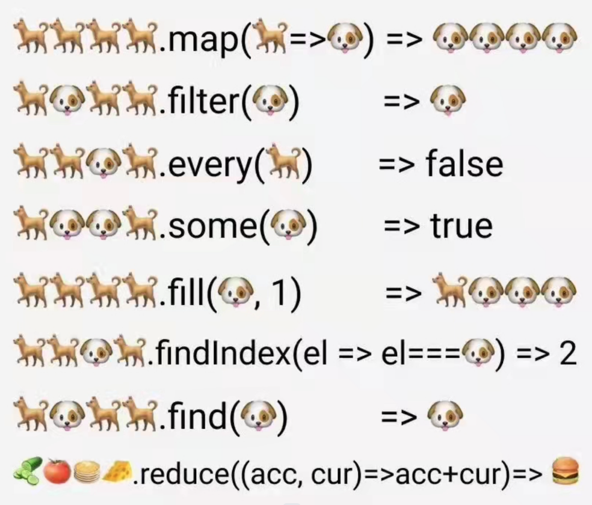

# 数组的常用方法记录
> 数组方法是工作中最常见的数据处理，熟练使用是一枚前端工程师的必备条件。

## <table><tr><td bgcolor="#eaf3d4">一、会改变原有数组</td></tr></table>
push : 尾部追加  (向数组的尾部添加一个或多个元素，返回值是数组的长度）

unshift : 头部添加 (向数组的头部添加一个或多个元素，并返回数组长度)

pop : 尾部删除    (删除数组最后一个元素）

shift : 头部删除 (删除数组第一个元素）

sort: : 排序 (对数组元素进行排序)

join : 分隔  (将数组的每一项通过自己指定的字符进行拼接、默认连接为 ",")

reverse : 反转 (将数组进行倒序)

splice ：删除元素或者添加元素，如：splice('从哪里','删几位','添加的元素')

## <table><tr><td bgcolor="#eaf3d4">二、不会改变原有数组</td></tr></table>

### （1）对数组进行遍历

map(): 该方法返回一个新数组，数组中的元素为原始数组元素调用函数处理后的值

forEach(): 用于循环调用数组中的每个元素，并将元素传回给回调函数

every(): 对数组中每一项进行判断，若每一项都返回true、则返回true,有一个为false，则返回false，并停止遍历

some(): 对数组每一项进行判断，如果有一个元素满足条件，则返回true , 并停止遍历，如果没有满足条件的元素，则返回false

### （2）查找数组中元素

filter(): 方法创建一个新的数组，新数组中的元素是通过检查指定数组中符合条件的所有元素

find(): 当数组中的元素在测试条件时返回 true 时, 返回符合条件的元素，之后的值不会再调用执行函数，如果没有符合条件的元素返回 undefined

findIndex(): 当数组中的元素返回 true 时, 该方法会返回符合条件的元素的索引位置，之后的值不会再调用执行函数，如果没有符合条件的元素返回 -1

### （3）截取数组

slice : 当有两个参数 如 slice('起始位置的下标','到哪里结束') 如果只有一个参数 返回的是从该指定位置到数组末尾的所有项

### （4） 图片示例

